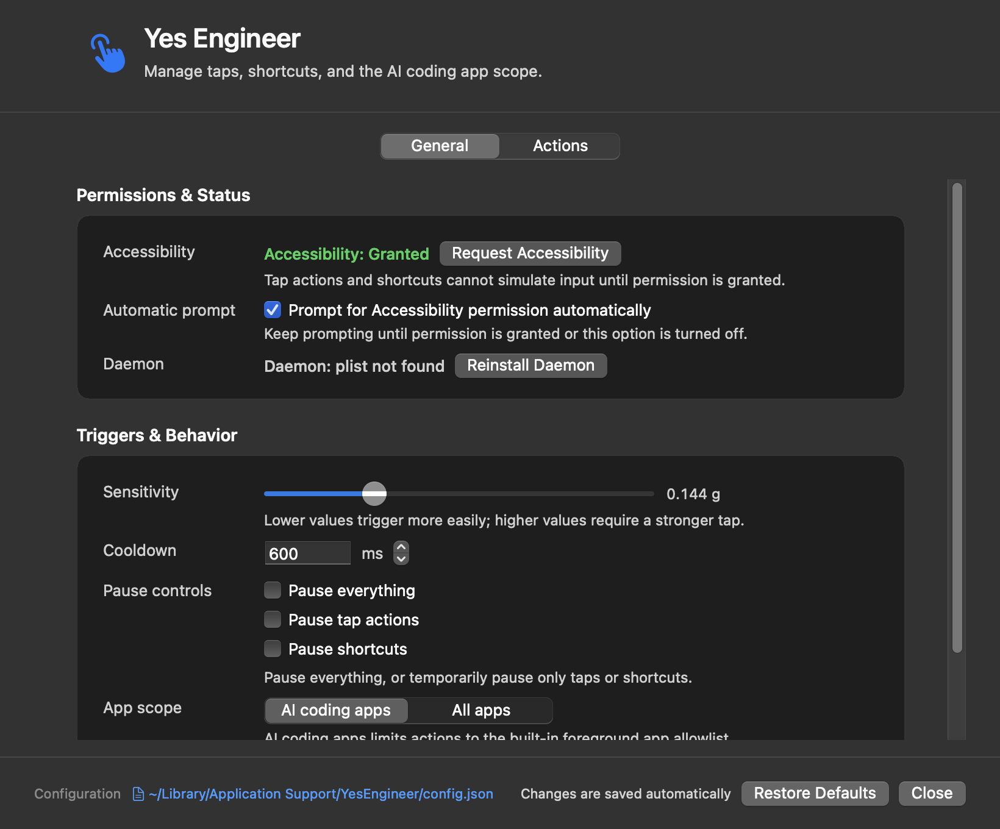
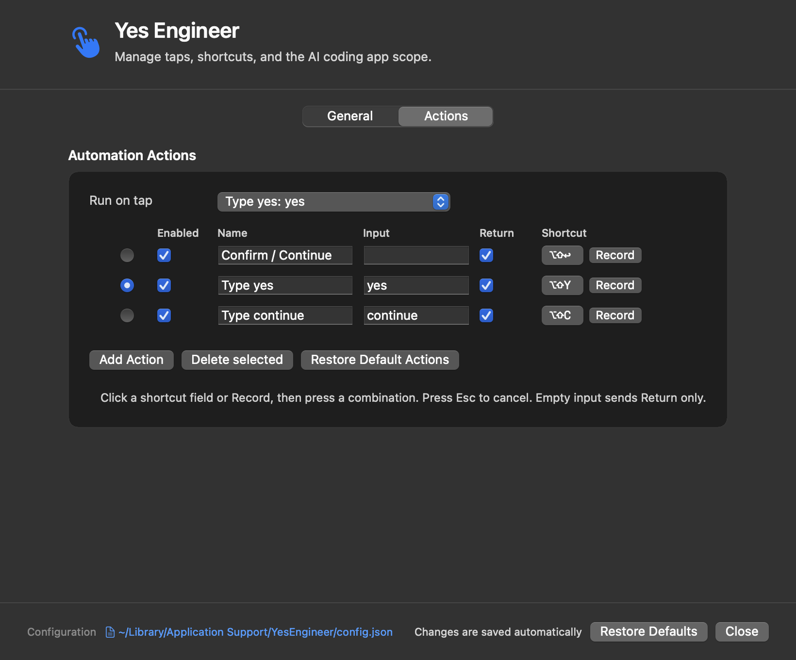
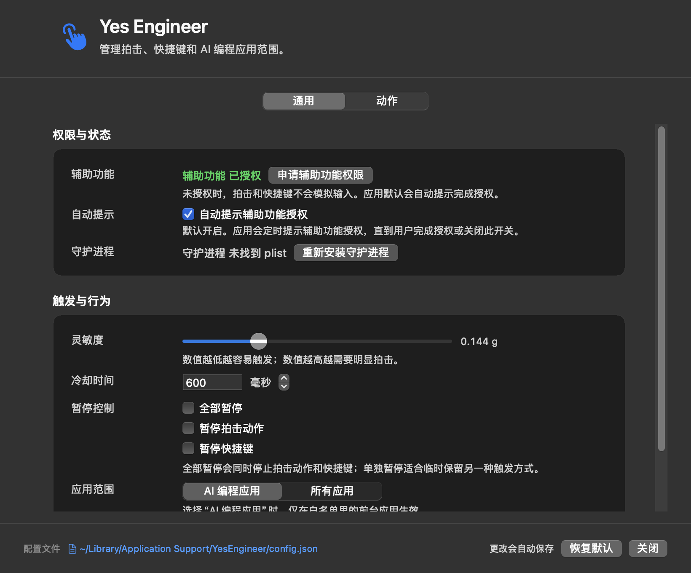
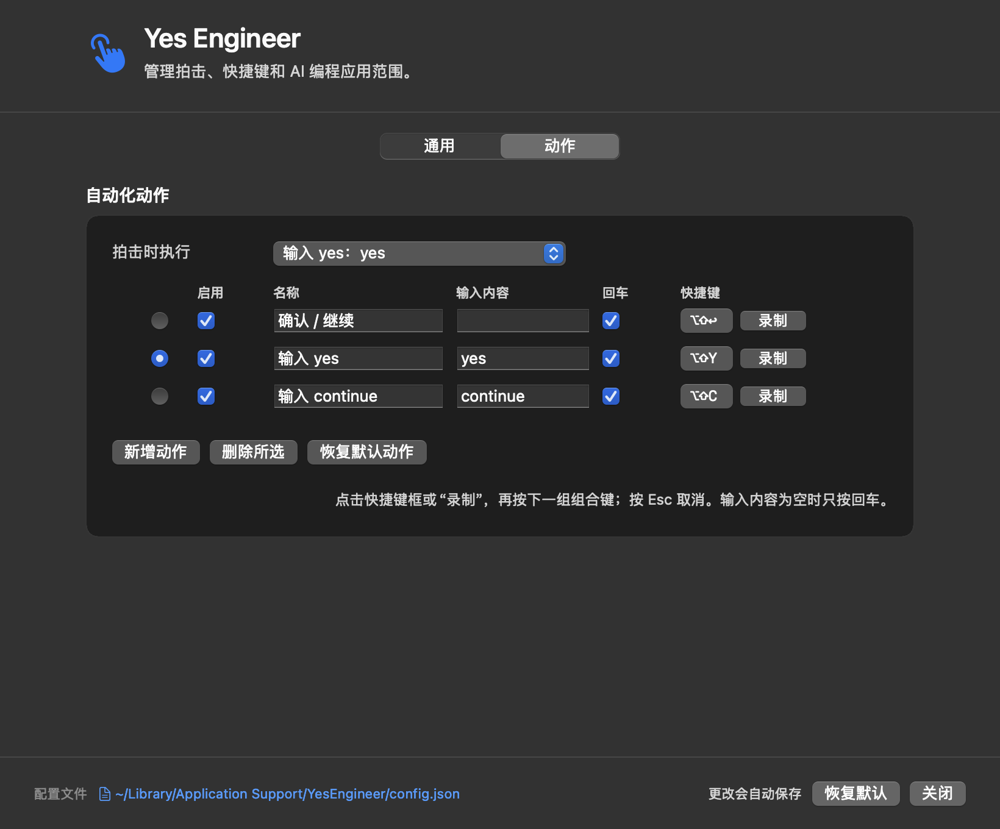

# Yes Engineer / Yes 工程师

**Yes Engineer** is a local macOS assistant for AI coding workflows. Tap your Apple Silicon Mac to run a configurable action, or use global shortcuts to type confirmation text and press Return.

The Chinese product name is **Yes 工程师**. The English name is used for the app, repository, bundle, executable, and release artifacts.

## English

### Highlights

- Opens the control panel automatically when the app launches.
- Saves every valid setting change immediately; there are no Save or Cancel buttons.
- Detects duplicate shortcuts inside Yes Engineer and global shortcuts already reserved by macOS or another app.
- Supports English and Simplified Chinese, selected automatically from the macOS preferred language.
- Runs locally without uploading sensor data, shortcuts, or typed content.
- Limits actions to common AI coding apps by default, with an optional all-apps mode.
- Supports configurable tap sensitivity, cooldown, feedback, pause controls, actions, text, Return behavior, and shortcuts.

### Control Panel



### Actions and Shortcuts



Shortcut recording validates the new combination immediately. If the shortcut is already assigned in Yes Engineer or reserved globally, the app explains the conflict and waits for another combination.

### Hardware Requirements

Yes Engineer requires an Apple Silicon Mac with a BMI286 accelerometer.

| Mac | Support |
|---|---|
| M2, M3, M4, M5 families | Yes |
| M1 Pro / M1 Max | Yes |
| Base M1 / M1 Air | No IMU |
| Intel Mac | No |

### Install

Download the latest `Yes-Engineer-*.app.zip` from [Releases](../../releases), unzip it, and move `Yes Engineer.app` to `/Applications`.

The current build uses an ad-hoc signature. If macOS quarantines the downloaded app, run:

```bash
xattr -dr com.apple.quarantine "/Applications/Yes Engineer.app"
```

Then open `Yes Engineer.app`. The control panel appears immediately.

### First Launch

1. Approve the bundled daemon so Yes Engineer can read the Mac accelerometer.
2. Grant Accessibility permission so the app can type text and press Return.
3. Adjust sensitivity if a light tap does not trigger reliably.

The default global shortcuts are:

| Shortcut | Action |
|---|---|
| `⇧⌥↩` | Press Return |
| `⇧⌥Y` | Type `yes`, then press Return |
| `⇧⌥C` | Type `continue`, then press Return |

Settings are stored at:

```text
~/Library/Application Support/YesEngineer/config.json
```

Existing settings from the former app are migrated automatically on first launch.

### Language

Yes Engineer reads the first language in macOS preferred languages:

- Chinese locales use Simplified Chinese.
- Other locales use English.

The localization layer is centralized in `Localization.swift`, so additional languages can be added without changing settings behavior.

## 中文

**Yes 工程师** 是一款面向 AI 编程场景的本地 macOS 助手。你可以拍击支持的 Apple Silicon Mac 来执行动作，也可以使用全局快捷键自动输入确认内容并按回车。

### 主要功能

- 软件启动时自动打开控制面板。
- 所有合法设置变更即时保存，不再需要“保存”或“取消”按钮。
- 快捷键录制时同时检查应用内重复和 macOS / 其他应用占用，并立即提示冲突原因。
- 支持英文和简体中文，默认自动匹配 macOS 首选语言。
- 完全本地运行，不上传传感器数据、快捷键或输入内容。
- 默认只在常见 AI 编程应用中触发，也可以切换为所有应用。
- 可配置灵敏度、冷却时间、反馈、暂停状态、拍击动作、输入内容、自动回车和全局快捷键。

### 控制面板



### 动作与快捷键



录制新快捷键后会立即进行冲突检测。如果组合键已经分配给其他动作，或已被系统和其他应用注册，界面会说明原因，并继续等待另一组快捷键。

### 硬件要求

Yes 工程师需要带 BMI286 加速度计的 Apple Silicon Mac。

| Mac | 支持情况 |
|---|---|
| M2、M3、M4、M5 全系列 | 支持 |
| M1 Pro / M1 Max | 支持 |
| 基础款 M1 / M1 Air | 不支持，没有 IMU |
| Intel Mac | 不支持 |

### 安装与首次启动

1. 从 [Releases](../../releases) 下载最新的 `Yes-Engineer-*.app.zip`。
2. 解压后将 `Yes Engineer.app` 移到 `/Applications`。
3. 首次启动时批准守护进程，并授予辅助功能权限。
4. 控制面板会自动打开，修改设置后会即时保存。

如果 macOS 拦截 ad-hoc 签名版本，请执行：

```bash
xattr -dr com.apple.quarantine "/Applications/Yes Engineer.app"
```

配置文件位于：

```text
~/Library/Application Support/YesEngineer/config.json
```

旧版本的设置会在首次启动时自动迁移。

## Build and Test / 构建与测试

```bash
git clone https://github.com/edwin2jiang/yes-engineer.git
cd yes-engineer

swift test --package-path app
go test ./...

cd app
./Bundle/build-app.sh
```

Requirements:

- macOS 13 or later
- Swift 5.9 or later
- Go 1.26 or later for the legacy CLI tests

The app bundle is written to:

```text
app/build/Yes Engineer.app
```

## Architecture / 架构

```text
Yes Engineer.app
├── Menu bar and control panel
├── Automatic settings persistence
├── Localized English / Simplified Chinese UI
├── Global shortcut registration and conflict detection
├── Accessibility-based text and Return input
└── Privileged YesEngineerDaemon
    └── BMI286 accelerometer sampling and tap detection
```

The Swift app is the primary product. The Go code in the repository root is retained as the early hardware-validation CLI.

## Privacy

Yes Engineer has no network feature. Sensor processing, shortcut handling, configuration, and text input all stay on the Mac.

## License

[MIT](LICENSE) © 2026 Wang Junjie
